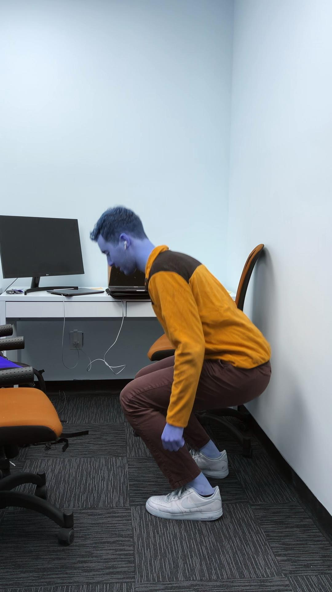
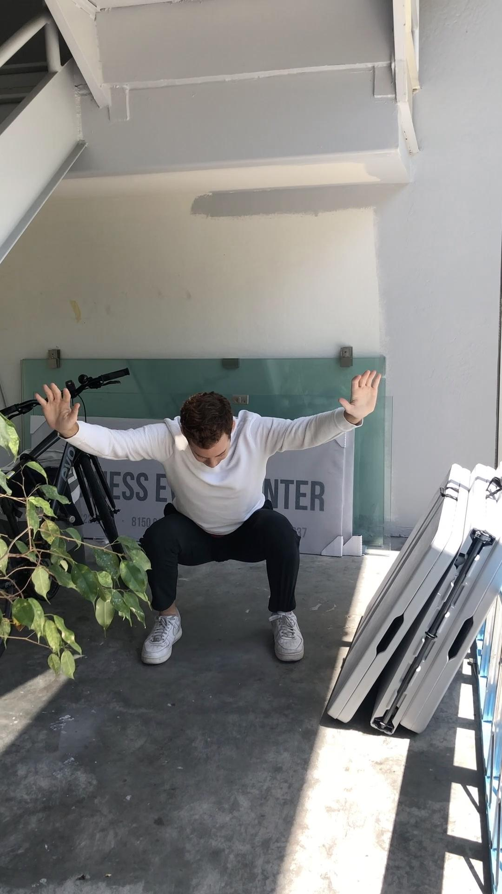

# LNewCo
#### Functional Physical Assessment of a Deep Squat Summer 2023

<figure>
    
    
    <figcaption>Base of Squat, Sagittal Plane (L) / Coronal Plane 
(R)</figcaption>
</figure>


## Table of Contents

[Project Introduction](#project-introduction)

[Screenshots](#screenshots)

[Setup / Installation](#setup--installation)

[Approach](#approach)

[Status](#status)

## Project Introduction:

During the summer of 2023, LNewCo was interested in growing and automating 
their functional movement assessment tests. The existing exam includes 
grip strength, VO2 max, and single leg stance tests. The trainer team expressed
interest in the functional movement assessment (FMS) to gain a deeper sense 
into client physical fitness while maintain a short test time. 

This Functional Deep Squat analysis pipeline supports LNewCo's physical 
fitness assessment. The primary function of this repository is to provide 
a personalized squat performance report that features user facing metrics 
as well as labels to support trainer workflows when designing intervention 
plans.

The repository also enables two secondary processes. First, EDA is enabled 
with the EDA.ipynb to support in the preliminary creation of heuristic 
scoring and classifications. The repository also features a data labelling 
flask app to enable trainers to label videos for heuristic and ML validation. 

## Output Report:

<figure>
    </img>
    <figcaption>1st page with Squat Scoring and Base of Squat 
Visual</figcaption>
</figure>

<figure>
    </img>
    <figcaption>2nd page with Muscle Heat Map</figcaption>
</figure>

<figure>
    </img>
    <figcaption>3rd page with Trainer Insights</figcaption>
</figure>


## Technologies Used:


## Setup / Installation:

1. Install the GitHub repository to your local machine ```git clone <ssh>```
2. Crate a folder entitled ```data``` in the project root directory
   1. Create 

### Analyzing Squat Batches

### Performing EDA

### Collecting Video Labels


## Approach:

Pose estimation is leveraged to analyze an individual's squat. Using a 
front a side view of the squat, pose estimation is performed wth Google's 
mediapipe library in Python. The specific points are used with  
trigonometry to estimate joint angles (ie: knee flexion/extension) and angles
between various body segment (ie: angle between the torso and shank segment). 

Domain knowledge from the " " book and feedback from trainers are the 
inspiration for rule-based 


## Status:

## MIT License

Copyright 2023 Ben Randoing

Permission is hereby granted, free of charge, to any person obtaining a copy of this software and associated documentation files (the “Software”), to deal in the Software without restriction, including without limitation the rights to use, copy, modify, merge, publish, distribute, sublicense, and/or sell copies of the Software, and to permit persons to whom the Software is furnished to do so, subject to the following conditions:

The above copyright notice and this permission notice shall be included in all copies or substantial portions of the Software.

THE SOFTWARE IS PROVIDED “AS IS”, WITHOUT WARRANTY OF ANY KIND, EXPRESS OR IMPLIED, INCLUDING BUT NOT LIMITED TO THE WARRANTIES OF MERCHANTABILITY, FITNESS FOR A PARTICULAR PURPOSE AND NONINFRINGEMENT. IN NO EVENT SHALL THE AUTHORS OR COPYRIGHT HOLDERS BE LIABLE FOR ANY CLAIM, DAMAGES OR OTHER LIABILITY, WHETHER IN AN ACTION OF CONTRACT, TORT OR OTHERWISE, ARISING FROM, OUT OF OR IN CONNECTION WITH THE SOFTWARE OR THE USE OR OTHER DEALINGS IN THE SOFTWARE.
